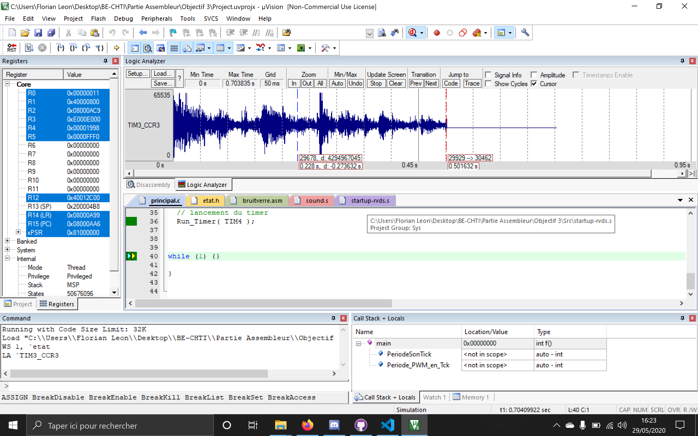

# Pour les tests
---
##### Visualisation de la coubre :  

Pour visualiser la courbe, il faut utiliser le logic analyser.
Il faut paramétrer le setup du logic analyser avec le timer3 (TIM3_CCR3), en mode analogique avec un maximum
de 0xFFFF. 
Après avoir fait le setup, il suffit de run et voir la courbe s'afficher.

##### Vérification de la durée entre deux échantillons succéssifs  :
Le son bruitverre comporte 5512 valeurs et l'acquisistion à été faite en 0,501632s.
On faisant le rapport 5512/0,501632s on trouve 91,01μs.

***NB :*** Des tests plus poussés sont peut être necessaires mais les résulats semblent cohérents.