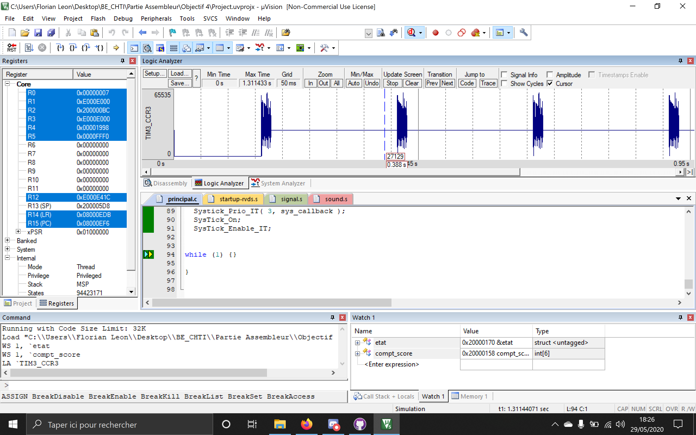

# Objectif 4
---
##### Projet final :  

On a fusionné nos objectifs 2 et 3. On a effectué 3 modifications : 
- La taille du son dans le champs _etat.taille_ pour ne pas que les sons émis se chevauchent compte tenu de la vitesse des tirs.
- La position _etat.position_ est initialisé à _etat.taille_ pour éviter qu'un son soit émis dès le lancement du jeu et donc avant le premier tir.
- Lorsque le score est incrémenté dans notre fonction sys_callback on remet la position à 0. 

